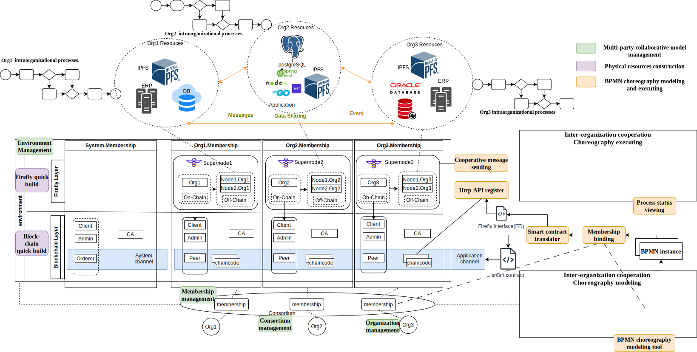
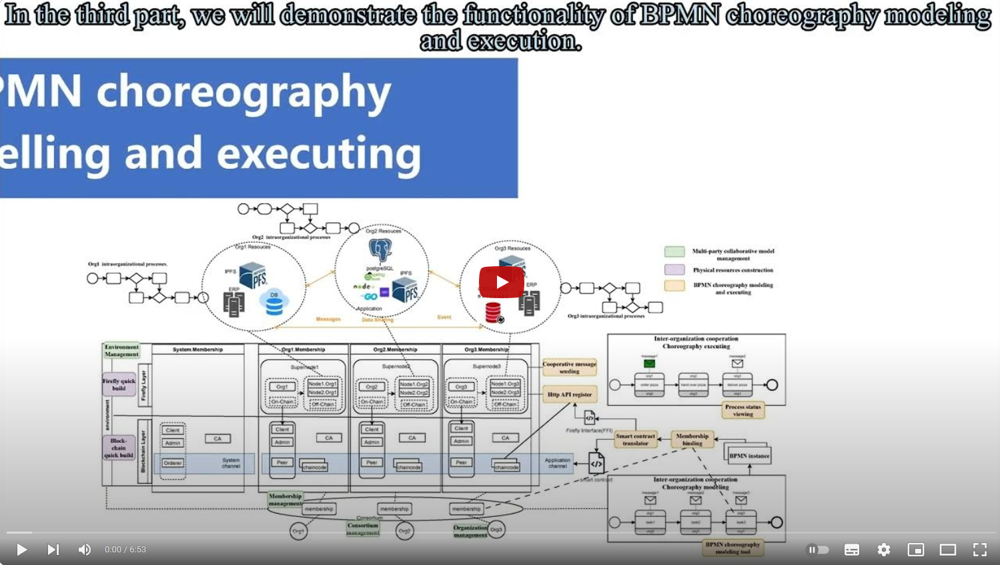

# IBC: An <u>**I**</u>ntegrated Framework Combining <u>**B**</u>lockchain with BPMN <u>**C**</u>horeography



[](https://www.youtube.com/watch?v=NukOZ39KPiE)

## Main Features

- **Multi-party collaborative model management**: IBC provides a multi-party collaborative model management platform, which can be used to manage the life cycle of models, including model creation, modification, deletion, and version management.
- **Physical resources construction**: IBC could quickly build blockchain as you need.
- **BPMN choreography modeling and executing**: IBC provides a visualized BPMN choreography modeling tool, which can be used to model the business process of multi-party collaboration.


## Project Structure 


```
┌───────────┐  ┌───────────────┐
│ Experiment├──┤ CaseTest      │  - case to test the correctness and completeness of the system
└───────────┘  │               │    * Real Case
               │               │    * Corner Case
               └────┬──────────┘
               ┌────┴──────────┐  - data of performance test
               │ Performance   │    * data of physical resources construction time
               │ Test          |    * data of chaincode execution time
               └───────────────┘    * data of chaincode generation time


┌──────────┐  ┌───────────────┐  - connector to the Docker Engine
│ src      ├──┤ agent         │    * create and manage Docker containers
└──────────┘  │               │    
              │               │  
              └─────┬─────────┘    
                    │
              ┌─────┴─────────┐  - main component to handle multi-party collaboration
              │ backend       │    * platform register and login
              │               |    * environment management
              └─────┬─────────┘    
                    │
              ┌─────┴─────────┐  - mirco-service to translate BPMN to chaincode
              │ chaincode     │    
              │ translator    │        
              └─────┬─────────┘
                    │
              ┌─────┴─────────┐  - modeling tool to create BPMN choreography model
              │ chor_js       │
              │               │        
              └─────┬─────────┘
                    │   
              ┌─────┴─────────┐  - front-end to interact with users
              │ front         │
              │               │        
              └───────────────┘  
              
```

## Deploy Guide

### Prerequisites

This project is based on Docker containers, which requires a Linux system/WSL2 environment, as well as Docker and Docker Compose.

### Requirements

#### GCC and Make

 `sudo apt-get install build-essential`

#### Python3

`sudo apt-get install python3-dev`

#### libgraphviz-dev

``` shell
apt-get update && apt-get install -y gettext-base graphviz libgraphviz-dev && apt-get autoclean && apt-get clean && apt-get autoremove && rm -rf /var/cache/apt/
```

### Database Configuration

Using docker compose to start the database service.

``` shell
docker-compose -f docker-compose.yml up -d
```

### backend Configuration

#### Dependency

``` shell
pip install -r requirements.txt
```

recommended to use python-venv.

#### Setting up the database

``` shell
python3 manage.py makemigrations
python3 manage.py migrate
```

------

### agent Configuration

#### Dependency

``` shell
pip install -r requirements.txt
```

Recommended to use python-venv.

#### Start the agent

``` shell
gunicorn server:app -c ./gunicorn.conf.py
```


