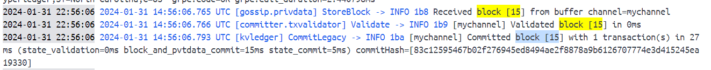
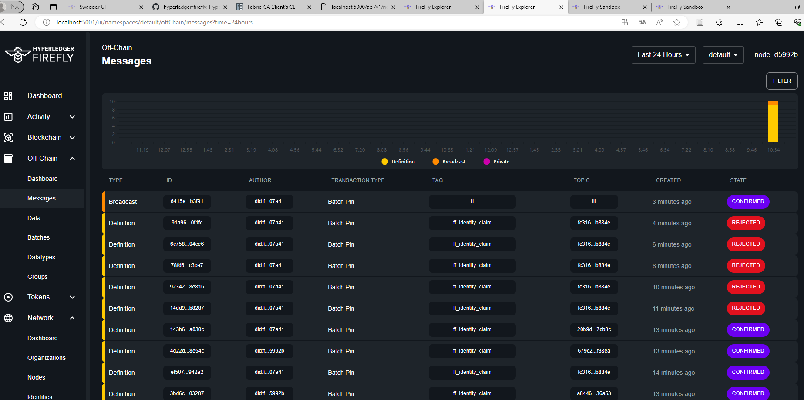

# 前置安装

## Install GCC and Related Tools: 
    sudo apt-get install build-essential
## Install Python Development Headers: 
    sudo apt-get install python3-dev

## libgraphviz安装
    apt-get update \
    && apt-get install -y gettext-base graphviz libgraphviz-dev \
    && apt-get autoclean \
    && apt-get clean \
    && apt-get autoremove && rm -rf /var/cache/apt/
## pygraphviz安装
    pip install pygraphviz

# requirements 安装
    pip install -r requirements.txt 

# RUN
    参考 cello/ startrc 
      start_database  prepare_api  start_api顺序
    python manage.py runserver

# 启动 前配置
 ## 1. 数据库迁移文件，生成表结构
    api-engine目录
        python3 manage.py makemigrations 
        python3 manage.py migrate

# 建立容器网络供cello使用

docker network create cello-net

# 启动agent

gunicorn server:app -c ./gunicorn.conf.py

# 文档相关
## cello改造后的注意规则
1. 必须由order的组织来创建network  改为order非solo模式
2. 上传的链码 是否两个组织都能看到？
3. 安装链码的时候 是否自己的组织只能安装自己的链码？
4. approve链码，orderurl去后端查询 不再前端传
4. commit 目前只能有order的组织去提交  并且peer list 要传两个组织
4. host的动态生成
    peer 都是原始url   order会截断
    sudo vim /etc/hosts
    service network-manager restart
5. 记得执行clean 清理storage
6. 要先启动后端，否则前端会占用8000端口
7. 一键启动，删除 脚本

## CA相关
1. 三个路径 必须存在 不存在需要手动创建   写个脚本初始化这三个路径   或者storage文件夹 传到GIT
STORAGE_PATH = os.path.join(PWD, "CA_related/storage")
TEMPLATE_PATH = os.path.join(PWD, "CA_related/template")
STORAGE_CA_SERVERS_PATH = os.path.join(PWD, "CA_related/storage/fabric-ca-servers")
2. 生成的affiliations  不对 且没必要
affiliations:
  Org1:
    caname: Org1
    department: Org1
    displayName: Org1
    name: Org1
  org1:
  - department1
  - department2
  org2:
  - department1
3. names配置的不对  这样大家生成的证书都一样了
csr:
  ca:
    expiry: 131400h
    pathlength: 0
  cn: com.example.com
  hosts:
  - com.example.com
  - localhost  
  names:
    - C: US
    L: null
    O: Hyperledger
    OU: Fabric
    ST: North Carolina
4. client相关的 不应该存在server的镜像中，应该存在engine那边，之后构造成MSP格式
5. agent 依赖于node，创建network之后，会启动所有node，之后去创建agent
5. fabric-client register enroll 不非是ca admin来做吧，只要有ca_server的证书就能注册？

## firefly 相关设计
1. firefly的CCP 文件中 包含fabricCA peer orderer相关   
    client的相关TLS证书也得共享 给firefly
    peer order的相关信息 也得写在firefly中
2. TODO 对比testnetwork 带CA的CCP 文件 与firefly的区别
    主要逻辑仿照 test-network生成 思路写
3. firefly-fabric-connect 也能做相关的register entroll操作，为了支持firefly创建client类型，也可注册peer类型等，但是与咱们生成MSP方式不兼容，所以咱们自己仿照Cello方式写CA相关
    https://github.com/hyperledger/firefly-fabconnect/tree/main
4. Firefly 目前FF init代理有问题，获取不到 
    go 安装的要export代理可以获取到，而且不要用bin包解压的方式，用GO安装   start时候不要开代理，它要找peer order等
  ff init 命令
  ff init fabric test_net  --ccp "/home/shenxinzhe-computer-ubuntu/code/loleido/cello/src/api-engine/opt/cello/org1.cello.com/crypto-config/peerOrganizations/org1.cello.com/org1.cello.com_ccp.yaml"   --msp "/home/shenxinzhe-computer-ubuntu/code/loleido/cello/src/api-engine/opt/cello"   --ccp "/home/shenxinzhe-computer-ubuntu/code/loleido/cello/src/api-engine/opt/cello/org2.cello.com/crypto-config/peerOrganizations/org2.cello.com/org2.cello.com_ccp.yaml"   --msp "/home/shenxinzhe-computer-ubuntu/code/loleido/cello/src/api-engine/opt/cello"   --channel testx   --chaincode firefly3
5. ff init后的 .firefly/stacks/ff_init/docker-compose.override.yml  一定加上order peer的docker网络
networks:
  default:
    name: fabric_test
    external: true
6. 生成organization文件夹后，一定chmod
    cd ./fabric-samples/test-network/organizations
    sudo chmod -R 777 ./
7. 启动以ff start test_net --verbose --no-rollback命令 能看到更多日志
  并且报错不会停止
8. /network/organizations/self
 post请求报错
 registering org and node for member 0
Post "http://127.0.0.1:5000/api/v1/network/organizations/self?confirm=true": EOF - retrying request...Post "http://127.0.0.1:5000/api/v1/network/organizations/self?confirm=true": EOF - retrying request...Post "http://127.0.0.1:5000/api/v1/network/organizations/self?confirm=true": EOF - retrying request...Post "http://127.0.0.1:5000/api/v1/network/organizations/self?confirm=true": EOF - retrying request...registering org and node for member 1

swagger请求同样报错
但是firefly的 前端 和pin到区块链都成功

9. firefly 静态ccp启动流程 
  1. 指定好路径，ff-init后，修改docker-override文件，加入cello-net网络
  2. ccp 文件中补充所有的peer相关
  2. 修改fabconnect 文件，
    "rpc": {
      "useGatewayClient": true,
      "configPath": "/Users/me/Documents/ff-test/ccp.yml"
    } 

## 

1. Network创建逻辑问题——需要确定哪些节点需要加入Network。 
  + environment ID引入，以此确认需要加入的Org。
  + Register初始化唯一联盟-Environment
  + Network Orderer

2. Channel创建逻辑问题——改造完Network应该就没问题了。

3. Chaincode相关

## 复现流程

1. 注册组织
2. 启动CA，申请证书文件(注意设置hosts，postman中注意申请节点的hosts)
3. 创建节点
4. 重复1-3，完成用户组织注册
5. 创建网络——（注意设置hosts）——使用env_id从数据库中查询，节点id从前端F12查询。注意，由System组织启动网络，其他组织启动channel以及链码相关
6. 创建通道

## startrc用法
进入cello路劲，source startrc，然后即可使用。
顺序：
1. clean
2. start_database
3. prepare_api
4. start_api
5. start_agent (需要在另一个终端)
6. start_dashboard（需要在另一个终端）

## 代码修改 TODO

peer_node_list = request.data.get("peer_node_list").split(",") 178 in chaincode_install, 修改成正式的formdata解析格式

1. 设置anchor的代码逻辑  done
  数据库存入 anchor节点。
  数据库体现 channel中有哪些peers
2. CELLO_HOME、firefly的端口只能一个环境，修改
3. 创建firefly node逻辑   done
4. hosts 从数据库读取所有node url，写入hosts  done
  首先需要检查hosts有没有此host
5. cello组织注册中的环境等写死，注释删掉  @罗
6. 所有的token验证，改为loleido-org token. cello的组织id变为传参  @罗

## 手动设置anchor节点
Org1
1. export PATH=/home/shenxinzhe-computer-ubuntu/code/loleido/cello/src/api-engine/opt/bin:$PATH
export FABRIC_CFG_PATH=/home/shenxinzhe-computer-ubuntu/code/loleido/cello/src/api-engine/opt/config
2. 设置组织1的anchor 节点
export CORE_PEER_TLS_ENABLED=true
export CORE_PEER_LOCALMSPID="Org1.cello.comMSP"
export CORE_PEER_TLS_ROOTCERT_FILE=/home/shenxinzhe-computer-ubuntu/code/loleido/cello/src/api-engine/opt/cello/org1.cello.com/crypto-config/peerOrganizations/org1.cello.com/peers/peer_org10.org1.cello.com/tls/ca.crt
export CORE_PEER_MSPCONFIGPATH=/home/shenxinzhe-computer-ubuntu/code/loleido/cello/src/api-engine/opt/cello/org1.cello.com/crypto-config/peerOrganizations/org1.cello.com/users/Admin@org1.cello.com/msp
export CORE_PEER_ADDRESS=peer_org10.org1.cello.com:44881
3. 
peer channel fetch config /home/shenxinzhe-computer-ubuntu/code/loleido/cello/src/api-engine/opt/cello/system/channel-artifacts/config_block.pb -o orderer0.cello.com:16445 --ordererTLSHostnameOverride orderer0.cello.com -c testx --tls --cafile "/home/shenxinzhe-computer-ubuntu/code/loleido/cello/src/api-engine/opt/cello/sys.cello.com/crypto-config/ordererOrganizations/cello.com/orderers/orderer0.cello.com/msp/tlscacerts/tlsca.cello.com-cert.pem"

cd channel-artifacts

4. 
configtxlator proto_decode --input config_block.pb --type common.Block --output config_block.json

jq '.data.data[0].payload.data.config' config_block.json > config.json

cp config.json config_copy.json
5. 
jq '.channel_group.groups.Application.groups.Org1.values += {"AnchorPeers":{"mod_policy": "Admins","value":{"anchor_peers": [{"host": "peer_org10.org1.cello.com","port": 7051}]},"version": "0"}}' config_copy.json > modified_config.json
6. 
configtxlator proto_encode --input config.json --type common.Config --output config.pb

configtxlator proto_encode --input modified_config.json --type common.Config --output modified_config.pb

configtxlator compute_update --channel_id testx --original config.pb --updated modified_config.pb --output config_update.pb
7. 
configtxlator proto_decode --input config_update.pb --type common.ConfigUpdate --output config_update.json

echo '{"payload":{"header":{"channel_header":{"channel_id":"testx", "type":2}},"data":{"config_update":'$(cat config_update.json)'}}}' | jq . > config_update_in_envelope.json

configtxlator proto_encode --input config_update_in_envelope.json --type common.Envelope --output config_update_in_envelope.pb

cd ..
8. 
peer channel update -f channel-artifacts/config_update_in_envelope.pb -c testx -o orderer0.cello.com:16445  --ordererTLSHostnameOverride orderer0.cello.com --tls --cafile "/home/shenxinzhe-computer-ubuntu/code/loleido/cello/src/api-engine/opt/cello/sys.cello.com/crypto-config/ordererOrganizations/cello.com/orderers/orderer0.cello.com/msp/tlscacerts/tlsca.cello.com-cert.pem"

Org2
1. 
export CORE_PEER_TLS_ENABLED=true
export CORE_PEER_LOCALMSPID="Org2.cello.comMSP"
export CORE_PEER_TLS_ROOTCERT_FILE=/home/shenxinzhe-computer-ubuntu/code/loleido/cello/src/api-engine/opt/cello/org2.cello.com/crypto-config/peerOrganizations/org2.cello.com/peers/peer_org20.org2.cello.com/tls/ca.crt
export CORE_PEER_MSPCONFIGPATH=/home/shenxinzhe-computer-ubuntu/code/loleido/cello/src/api-engine/opt/cello/org2.cello.com/crypto-config/peerOrganizations/org2.cello.com/users/Admin@org2.cello.com/msp
export CORE_PEER_ADDRESS=peer_org20.org2.cello.com:44425
2. 
peer channel fetch config /home/shenxinzhe-computer-ubuntu/code/loleido/cello/src/api-engine/opt/cello/system/channel-artifacts/config_block.pb -o orderer0.cello.com:16445 --ordererTLSHostnameOverride orderer0.cello.com -c testx --tls --cafile "/home/shenxinzhe-computer-ubuntu/code/loleido/cello/src/api-engine/opt/cello/sys.cello.com/crypto-config/ordererOrganizations/cello.com/orderers/orderer0.cello.com/msp/tlscacerts/tlsca.cello.com-cert.pem"

cd channel-artifacts

3. 
configtxlator proto_decode --input config_block.pb --type common.Block --output config_block.json

jq '.data.data[0].payload.data.config' config_block.json > config.json

cp config.json config_copy.json
4. 
jq '.channel_group.groups.Application.groups.Org2.values += {"AnchorPeers":{"mod_policy": "Admins","value":{"anchor_peers": [{"host": "peer_org20.org2.cello.com","port": 7051}]},"version": "0"}}' config_copy.json > modified_config.json
5. 
configtxlator proto_encode --input config.json --type common.Config --output config.pb

configtxlator proto_encode --input modified_config.json --type common.Config --output modified_config.pb

configtxlator compute_update --channel_id testx --original config.pb --updated modified_config.pb --output config_update.pb
6. 
configtxlator proto_decode --input config_update.pb --type common.ConfigUpdate --output config_update.json

echo '{"payload":{"header":{"channel_header":{"channel_id":"testx", "type":2}},"data":{"config_update":'$(cat config_update.json)'}}}' | jq . > config_update_in_envelope.json

configtxlator proto_encode --input config_update_in_envelope.json --type common.Envelope --output config_update_in_envelope.pb

cd ..
7. 
peer channel update -f channel-artifacts/config_update_in_envelope.pb -c testx -o orderer0.cello.com:16445  --ordererTLSHostnameOverride orderer0.cello.com --tls --cafile "/home/shenxinzhe-computer-ubuntu/code/loleido/cello/src/api-engine/opt/cello/sys.cello.com/crypto-config/ordererOrganizations/cello.com/orderers/orderer0.cello.com/msp/tlscacerts/tlsca.cello.com-cert.pem"